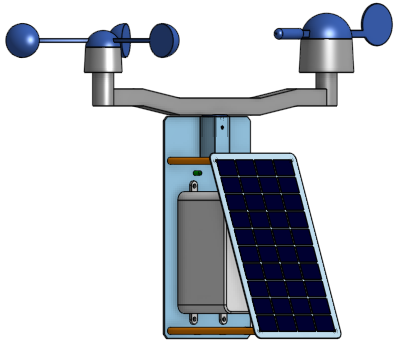
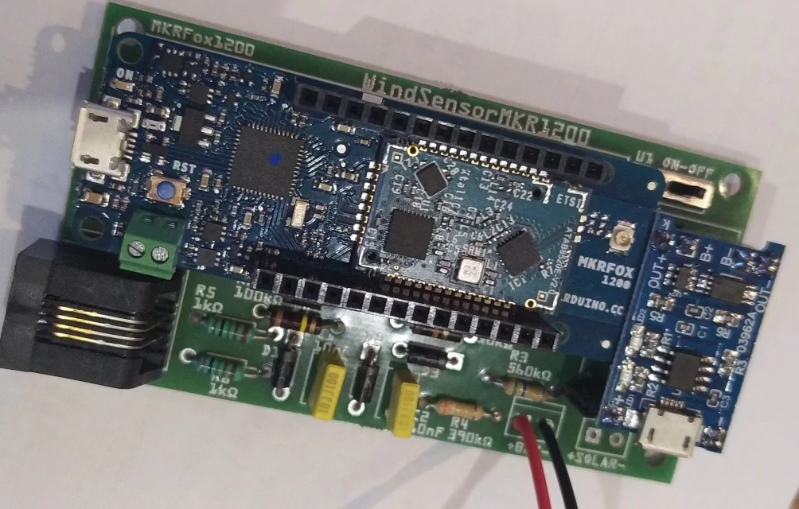
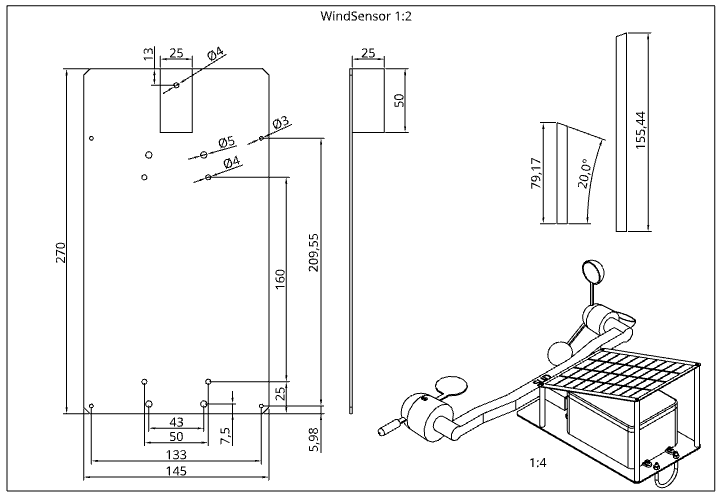

- [Vue 3D et plans](#balise)
- [Caractéristiques](#caractéristiques-)
- [Composants](#composants-liste-dachat-)
- [Assemblage carte électronique](#assemblage-carte-électronique)
- [Recommendations](#recommendations)
- [Programmation](#programmation)

## Balise météo libre pour <a href="https://openwindmap.org/">https://openwindmap.org/</a>
* <a href="https://cad.onshape.com/documents/6b13ef821e263382372072eb/w/90bcda648e57637a9ae0e956/e/43a202e3448bb59f5c78bd82">modèle 3D libre onshape</a> 
 
* carte électronique montée 
* <a href="https://github.com/dvarrel/WindSensorMKR1200/blob/main/img/support.pdf" target="_blank">support</a> 

## Caractéristiques :
* low power @1Mhz : 2mA (voir le doc energy_saving.ods)
* librairie arduino sigfox modifiée pour empêcher clignotement LED lors de l'envoi
* avec une pile 18650 (2000mAh), 36j d'autonomie sans soleil
* panneau solaire 5W -> recharge pile sous 4h de soleil max
* on peut donc prendre un plus petit PV mais les prix sont identiques
* en option, avec un bme280 (7€) , on ajoute la mesure de T,P,%RH

## Composants <a href="https://my.aliexpress.com/wishlist/shared.htm?groupId=800000004232261">(liste d'achat)</a> :
* <a href="https://store.arduino.cc/products/arduino-mkr-fox-1200">arduino mkrfox1200 et son antenne</a>
* girouette, anémomètre, bras Misol
* module de charge Lithium TP4056
* coffret pour piles 18650 ( vous pouvez récupérer des piles dans une vieille batterie d'ordinateur portable )
* <a href="https://elec44.fr/eur-ohm/107264-eur-ohm-boite-de-derivation-etanche-ip55-couvercle-avec-vis-14-de-tour-155x110x80-mm-ref-50036-3663752011051.html">boitier étanche électrique</a>
* résistances : 1k(x2), 10k, 100k, 390k, 560k
* condensateurs : 10nF (x2)
* diodes esr : 1N5818 (x4)
* interrupteur on/off, sur carte et/ou déporté étanche
* connecteur rj11 pour CI
* si vous êtes dans une zone mal couverte, l'antenne livrée avec la carte arduino peut être insuffisante, acheter alors une 5dBi

## Assemblage carte électronique
* voir le schéma, il y a quelques composants à souder : résistances, condensateurs , diodes esr
* vous pouvez acheter un connecteur vertical RJ11 ou souder les fils directement sur la carte
* vous pouvez acheter le circuit imprimé (vendus par 3) chez <a href="https://aisler.net/p/UPLBVEWD">https://aisler.net/p/UPLBVEWD</a>
* ou contactez moi, je peux peut-être vous en fournir au détail s'il m'en reste ( les petits composants aussi , je les ai achetés par 50 )

## Recommendations
* utiliser de la quincaillerie inox ou nylon
* vous pouvez vernir les cartes pour prévenir l'oxydation
 
## Programmation
* installer arduino
* dans arduino, via le gestionnaire de cartes, ajouter la mkrfox ( arduino SAMD boards )
* installer les bibliothèques mkrfox (arduino sigfox mkrfox1200 ) et arduino low power
* dans dev il y a le programme board_infos qui vous donnera l'ID et le PAC à transmettre en privé à Nicolas sur le forum pour enregistrer la carte sur le réseau
* le programme calibration vous permet de tester la balise
* finalement, le programme windsensor contient le programme arduino à téléverser dans la carte

vous pouvez me contacter via le forum <a href="https://www.openwindmap.org/">openwindmap</a>, mon pseudo est dam74
