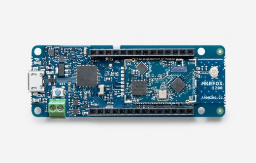
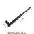
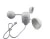
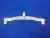
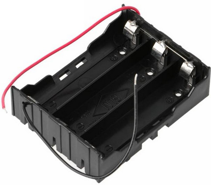
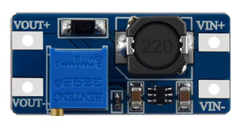
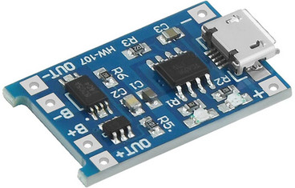
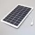
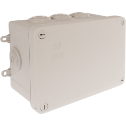

## Wind Sensor for https://openwindmap.org/

## features :
* low power @1Mhz : 2mA , 144Wh/year (see energy_saving.ods)
* modify sigfox library to turn off LED blinking

## TODO :
* using timer and adc during deepsleep to reeduce current (-90% )

## parts :
*  https://store.arduino.cc/arduino-mkr-fox-1200-1408
*  https://fr.aliexpress.com/item/32972870968.html
*  https://fr.aliexpress.com/item/1000001854801.html
*  https://fr.aliexpress.com/item/2035928190.html
*  https://fr.aliexpress.com/item/32835940825.html
*  https://fr.aliexpress.com/item/32857541349.html
*  https://fr.aliexpress.com/item/4000522316080.html
*  https://fr.aliexpress.com/item/4000522397541.html
*  https://fr.aliexpress.com/item/1005002275606822.html
*  https://elec44.fr/eur-ohm/107264-eur-ohm-boite-de-derivation-etanche-ip55-couvercle-avec-vis-14-de-tour-155x110x80-mm-ref-50036-3663752011051.html